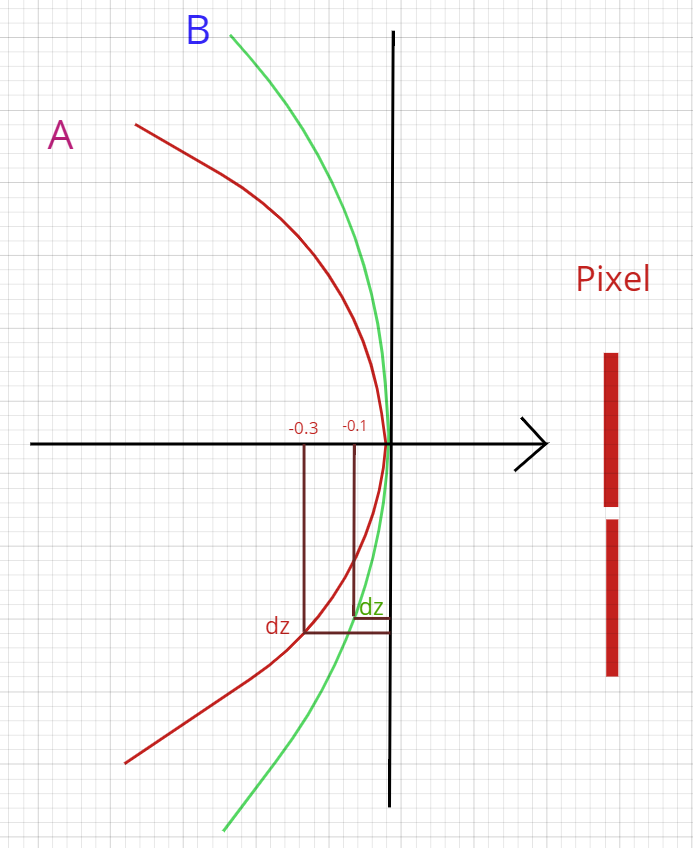

# DepthOffset

1. OpenGL Depth Offset可以支持 line 和 point.

When GL_POLYGON_OFFSET_FILL, GL_POLYGON_OFFSET_LINE, or GL_POLYGON_OFFSET_POINT is enabled, each fragment's depth value will be offset after it is interpolated from the depth values of the appropriate vertices. The value of the offset is factor×DZ+r×units, where DZ is a measurement of the change in depth relative to the screen area of the polygon, and r is the smallest value that is guaranteed to produce a resolvable offset for a given implementation. The offset is added before the depth test is performed and before the value is written into the depth buffer.

2.  The meaning of Dz 
