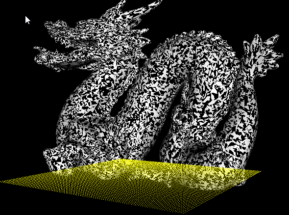
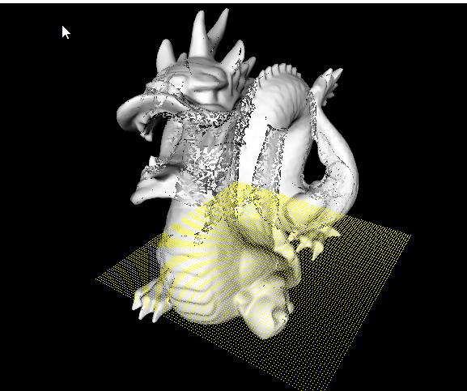
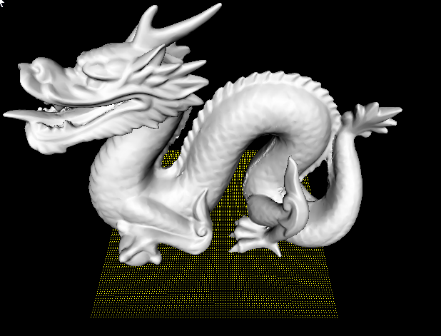
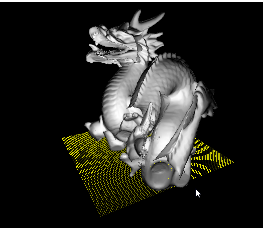

# dragon_rendering

1. Download the dragon model :
http://graphics.stanford.edu/data/3Dscanrep/

2. Rendering problem:

Solution : Enable Face Full and Cull back face.

Solution: Enable Depth test

Fixed.

Try to cull back face and abs(normal*light_direction)

Questions:
What is front face?
glFrontFace  . The initial value is GL_CCW.
Tips:

In a scene composed entirely of opaque closed surfaces, back-facing polygons are never visible. Eliminating these invisible polygons has the obvious benefit of speeding up the rendering of the image